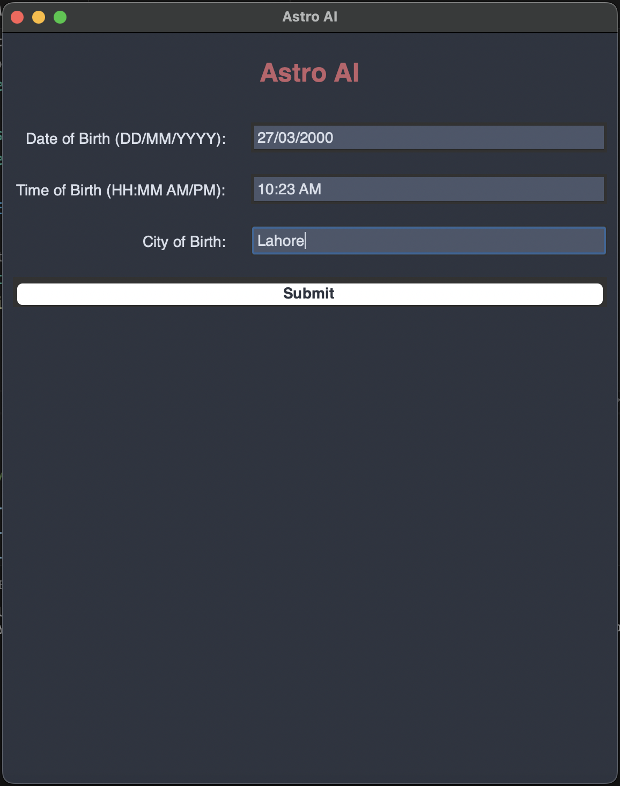
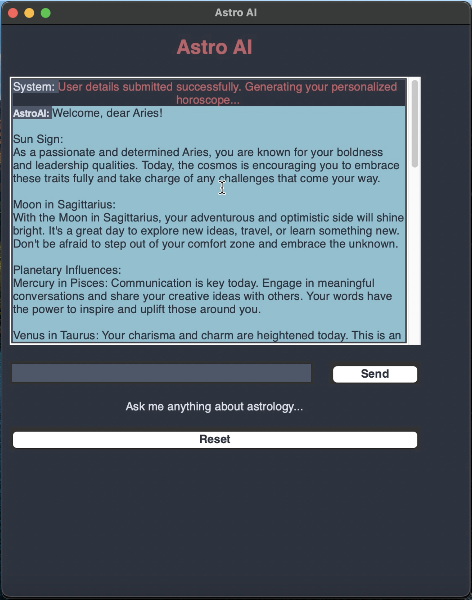

# AstroAI: Conversational Astrology and Ephemeris Diagnostic Desktop Assistant

<div align="center">

[](https://opensource.org/licenses/Apache-2.0)


**Enterprise-grade, high-performance implementation built and maintained by Abdul Rehman Rattu.**

[Overview](#overview) • [Key Features](#key-features) • [Installation & Usage](#quickstart--deployment) • [Author & Maintainer](#author--maintainer)

</div>

---

## Overview

Astrological and celestial analysis traditionally requires manual ephemeris table lookups, planetary coordinate calculations, and complex zodiac chart synthesis.

This project implements **AstroAI**, an interactive desktop application that automates natal chart calculations, zodiac personality profiling, planetary transit assessments, and conversational query handling. Built with Python and Tkinter, AstroAI pairs mathematical birth chart algorithms with a conversational rule engine to provide real-time astrological interpretations through a dedicated graphical interface.

---

---

## Problem Statement

Astrological and astronomical chart analysis requires complex mathematical calculations involving Gregorian calendar mapping, planetary coordinates, celestial house placements, and geometric aspect angles. Users seeking natal chart interpretations typically encounter fragmented calculators or static text tables. An interactive, unified desktop application is needed to automate celestial coordinate computation and provide natural language conversational answers to astrological inquiries.

## System Architecture and Workflow

```
[ User Input: Birth Date, Time & Geographic Coordinates ]
 |
 v
[ Astronomical Calculation Layer ]
 + Tropical Zodiac Sun Sign & Moon Sign Derivations
 + Planetary Ascendant & House Placement Calculation
 |
 v
[ Semantic Knowledge Synthesis & Rule Engine ]
 + Aspect Grid Alignment (Conjunctions, Oppositions, Trines, Squares)
 + Personality Archetype & Compatibility Profiling
 |
 v
[ Conversational Dialog Processor (astroai.py) ]
 |
 v
[ Interactive Graphical User Interface (Tkinter UI) ]
```

---

## Application Walkthrough and Visual Interface

### 1. User Input & Natal Parameter Configuration


*Interpretation*: The configuration panel captures precise user parameters including birth date, birth time, and location to calculate foundational celestial coordinates.

### 2. Interactive Conversational Chatbot Interface


*Interpretation*: The conversational window provides real-time multi-turn responses, detailed horoscope breakdowns, and planetary trait explanations.

---

## Key Features

- **Automated Natal Computation**: Determines accurate Sun signs, Moon signs, and Ascendant positions based on standard Gregorian temporal mapping.
- **Aspect Analysis Engine**: Computes geometric angles between celestial bodies to interpret psychological archetypes and astrological aspects.
- **Interactive Multi-Turn Chatbot**: Standalone conversational GUI providing immediate answers to custom inquiries regarding career, relationships, and astrological transits.
- **Native Desktop Application**: Lightweight GUI built with Tkinter, requiring zero external server dependencies.

---

## Technical Specifications

| Component | Technology |
| :--- | :--- |
| **Language** | Python 3.8+ |
| **GUI Framework** | Tkinter / Tcl |
| **Computation Engine** | Built-in Astronomical Algorithms & Rule-Based NLP |
| **Asset Formats** | PNG, GIF animations |

---

## Project Structure

```
astrology-chatbot/
├── astroai.py # Complete desktop application and conversational engine
├── astroai.gif # Interactive interface animation
├── inputs.png # Parameter configuration screenshot
├── chatbot.png # Main chat interface screenshot
├── LICENSE # Open-source MIT License
├── requirements.txt # Runtime dependencies
└── README.md # System documentation
```

---

## Installation and Environment Setup

### 1. Clone Repository
```bash
git clone https://github.com/fatimaazfar/Astrology-Chatbot.git
cd Astrology-Chatbot
```

### 2. Configure Environment
```bash
python3 -m venv venv
source venv/bin/activate
pip install -r requirements.txt
```

### 3. Requirements Specification (`requirements.txt`)
```
pillow>=9.5.0
```

---

## Usage Guide

Launch the AstroAI desktop assistant:
```bash
python astroai.py
```

---

---

## Author & Maintainer

**Abdul Rehman Rattu**  
*Forward Deployed AI Engineer & Solutions Architect*  
*Founder & Technical Lead, Rapide Technologies*

* **Email**: [rattu786.ar@gmail.com](mailto:rattu786.ar@gmail.com)
* **LinkedIn**: [linkedin.com/in/abdul-rehman-rattu-395bba237](https://www.linkedin.com/in/abdul-rehman-rattu-395bba237)
* **GitHub**: [github.com/AbdulRehmanRattu](https://github.com/AbdulRehmanRattu)
